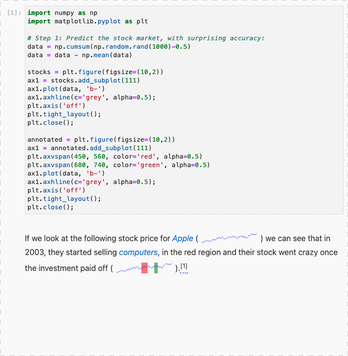
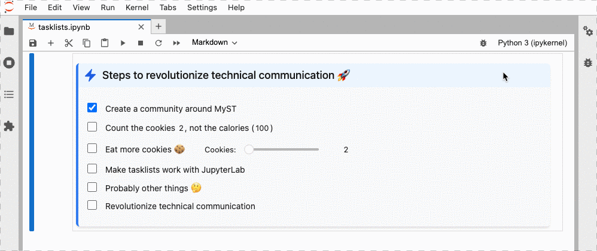

# JupyterLab MyST Extension

[![Made with MyST][myst-badge]][myst-link]
[![GitHub Actions Status][actions-badge]][actions-link]
[![Launch on Binder][binder-badge]][binder-link]
[![PyPI][pypi-badge]][pypi-link]

Render markdown cells using [MyST Markdown](https://mystmd.org/), including support for rich frontmatting, interactive references, admonitions, figure numbering, tabs, proofs, cards, and grids!


> **Note**: If you are looking for the version of this repository based on jupyterlab-markup,
> see the [`v0 branch`](https://github.com/executablebooks/jupyterlab-myst/tree/v0).

> **Info**
> This extension is composed of a Python package named `jupyterlab_myst`
> for the server extension and a NPM package named `jupyterlab-myst`
> for the frontend extension.

## Requirements

- JupyterLab >= 4.0.0b0

## Install

To install the extension, execute:

```bash
pip install jupyterlab_myst
```

## Features

`jupyterlab-myst` is a fully featured markdown renderer for technical documents, [get started with MyST Markdown](https://mystmd.org/guide/quickstart-myst-markdown). It supports the MyST `{eval}` inline role, which facilitates the interweaving of code outputs and prose. For example, we can use inline expressions to explore the properties of a NumPy array.

In the code cell:

```python
import numpy as np
array = np.arange(4)
```

In the markdown cell:

```markdown
Let's consider the following array: {eval}`array`.

We can compute the total: {eval}`array.sum()` and the maximum value is {eval}`array.max()`.
```

This will evaluate inline, and show:

```text
Let's consider the following array: array([0, 1, 2, 3]).

We can compute the total: 6 and the maximum value is 3.
```

You can also use this with `ipywidgets`, and have inline interactive text:


Or with `matplotlib` to show inline spark-lines:



You can also edit tasklists directly in the rendered markdown.



## Usage

[MyST][myst-quickstart] is a flavour of Markdown, which combines the fluid experience of writing Markdown with the programmable extensibility of reStructuredText. This extension for JupyterLab makes it easier to develop rich, computational narratives, technical documentation, and open scientific communication.

### Restore default renderer :notebook:

By default, the MyST renderer becomes the default notebook renderer. This means that MyST notebook rendering works out-of-the-box with Jupytext and other notebook-aware extensions. Whilst this extension is in a pre-release state, there is also a "legacy mode" that integrates MyST rendering as an additional `Open With` option that does not replace the default notebook renderer. To enable legacy mode, disable the `jupyterlab-myst:plugin` plugin with:

```bash
jupyter labextension disable jupyterlab-myst:plugin
```

### Execution :rocket:

To facilitate inline expressions, `jupyterlab-myst` defines a `jupyterlab-myst:executor` plugin. This plugin sends expression code fragments to the active kernel when the user "executes" a Markdown cell. To disable this functionality, disable the `jupyterlab-myst:executor` plugin with:

```bash
jupyter labextension disable jupyterlab-myst:executor
```

### Trust :detective:

Jupyter Notebooks implement a [trust-based security model](https://jupyter-notebook.readthedocs.io/en/stable/security.html). With the addition of inline expressions, Markdown cells are now considered when determining whether a given notebook is "trusted". Any Markdown cell with inline-expression metadata (with display data) is considered "untrusted". Like outputs, expression results are rendered using safe renderers if the cell is not considered trusted.
Executing the notebook will cause each cell to be considered trusted.

To facilitate this extension of the trust model, the `jupyterlab_myst` server extension replaces the `NotebookNotary` from `nbformat` with `MySTNotebookNotary`. This can be disabled with

```bash
jupyter server extension disable jupyterlab-myst
```

By disabling this extension, it will not be possible to render unsafe expression results from inline expressions; the `MySTNotebookNotary` adds additional code that makes it possible to mark Markdown cells as trusted.

## Uninstall

To remove the extension, execute:

```bash
pip uninstall jupyterlab_myst
```

## Troubleshoot

If you are seeing the frontend extension, but it is not working, check
that the server extension is enabled:

```bash
jupyter server extension list
```

If the server extension is installed and enabled, but you are not seeing
the frontend extension, check the frontend extension is installed:

```bash
jupyter labextension list
```

## Contributing

### Development install

Note: You will need NodeJS to build the extension package.

The `jlpm` command is JupyterLab's pinned version of
[yarn](https://yarnpkg.com/) that is installed with JupyterLab. You may use
`yarn` or `npm` in lieu of `jlpm` below.

```bash
# Clone the repo to your local environment
# Change directory to the jupyterlab_myst directory
# Install package in development mode
pip install -e ".[test]"
# Link your development version of the extension with JupyterLab
jupyter labextension develop . --overwrite
# Server extension must be manually installed in develop mode
jupyter server extension enable jupyterlab_myst
# Rebuild extension Typescript source after making changes
jlpm build
```

You can watch the source directory and run JupyterLab at the same time in different terminals to watch for changes in the extension's source and automatically rebuild the extension.

```bash
# Watch the source directory in one terminal, automatically rebuilding when needed
jlpm watch
# Run JupyterLab in another terminal
jupyter lab
```

With the watch command running, every saved change will immediately be built locally and available in your running JupyterLab. Refresh JupyterLab to load the change in your browser (you may need to wait several seconds for the extension to be rebuilt).

By default, the `jlpm build` command generates the source maps for this extension to make it easier to debug using the browser dev tools. To also generate source maps for the JupyterLab core extensions, you can run the following command:

```bash
jupyter lab build --minimize=False
```

### Development uninstall

```bash
# Server extension must be manually disabled in develop mode
jupyter server extension disable jupyterlab_myst
pip uninstall jupyterlab_myst
```

In development mode, you will also need to remove the symlink created by `jupyter labextension develop`
command. To find its location, you can run `jupyter labextension list` to figure out where the `labextensions`
folder is located. Then you can remove the symlink named `jupyterlab-myst` within that folder.

### Testing the extension

#### Server tests

This extension is using [Pytest](https://docs.pytest.org/) for Python code testing.

Install test dependencies (needed only once):

```sh
pip install -e ".[test]"
# Each time you install the Python package, you need to restore the front-end extension link
jupyter labextension develop . --overwrite
```

To execute them, run:

```sh
pytest -vv -r ap --cov jupyterlab_myst
```

#### Frontend tests

This extension is using [Jest](https://jestjs.io/) for JavaScript code testing.

To execute them, execute:

```sh
jlpm
jlpm test
```

#### Integration tests

This extension uses [Playwright](https://playwright.dev/docs/intro) for the integration tests (aka user level tests).
More precisely, the JupyterLab helper [Galata](https://github.com/jupyterlab/jupyterlab/tree/master/galata) is used to handle testing the extension in JupyterLab.

More information are provided within the [ui-tests](./ui-tests/README.md) README.

### Packaging the extension

See [RELEASE](RELEASE.md)

[myst-badge]: https://img.shields.io/badge/made%20with-myst-orange
[myst-link]: https://mystmd.org
[myst-quickstart]: https://mystmd.org/guide/quickstart-myst-markdown
[actions-badge]: https://github.com/executablebooks/jupyterlab-myst/workflows/Build/badge.svg
[actions-link]: https://github.com/executablebooks/jupyterlab-myst/actions/workflows/build.yml
[binder-badge]: https://mybinder.org/badge_logo.svg
[binder-link]: https://mybinder.org/v2/gh/executablebooks/jupyterlab-myst/main?urlpath=lab
[pypi-badge]: https://img.shields.io/pypi/v/jupyterlab-myst.svg
[pypi-link]: https://pypi.org/project/jupyterlab-myst
